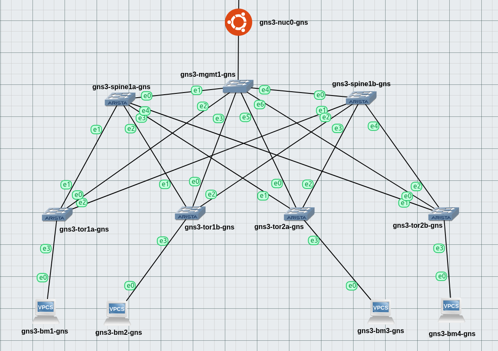

# Arisra Sandbox (Playground)

This is just my playground for testing advanced networks features such as ``iBGP``, ``eBGP``, ``BGP-EVPN`` and more on ``GNS v3``.

## Network Topology

## Ranges
- Spine <> ToR et ToR <> ToR: 172.31.0.0/18
- ToR Loopback 0 (BGP): 172.31.64.0/21
- ToR Loopback 1 (vxlan): 172.31.80.0/22
- Route-Server (Loopback 0): 172.31.87.0/25

## Requirements
- A physical server
- [GNS v3](https://www.gns3.com/)
- Arista vEOS-lab image